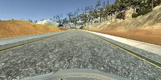
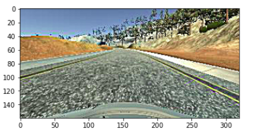
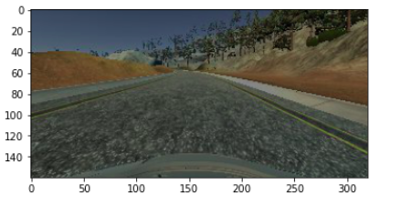

# **Behavioral Cloning** 

## Writeup 

---

**Behavioral Cloning Project**

The goals / steps of this project are the following:
* Use the simulator to collect data of good driving behavior
* Build, a convolution neural network in Keras that predicts steering angles from images
* Train and validate the model with a training and validation set
* Test that the model successfully drives around track one without leaving the road

#### Files in the project

My project includes the following files:
* model.py containing the script to create and train the model
* drive.py for driving the car in autonomous mode
* model.h5 containing a trained convolution neural network 
* writeup_report.md summarizing the results

### Model Architecture and Training Strategy

I have used CNN model which is described in `End-to-End Learning for Self-Driving Cars` paper. The model is defined in `model.py`. First of all, data is normalized in the model using a Keras lambda layer. Images are cropped to see only half bottom of the image to get rid of uncessary part of the image. Then, I constructed the model. I added dropouts on two outputs of fully-connected layer. 
The model architecture is as follows: 

| Layer         		|     Description	        					| 
|:---------------------:|:---------------------------------------------:| 
| Input         		| 160,320,3 RGB image   							| 
| Lambda        		| Normalizing the image   							|
| Cropping        		| Output: 65,320,3  							|
| Convolution 5x5     	| 2x2 stride,  outputs 31x158x24 	|
| ELU					|	|
| Convolution 5x5     	| 2x2 stride, outputs 14x77x36 	|
| ELU					|	|
| Convolution 5x5     	| 2x2 stride,  outputs 5x37x48	|
| ELU					|	|
| Convolution 3x3     	|   outputs 3x35x64	|
| ELU					|	|
| Convolution 3x3     	|   outputs 1x33x64 	|
| ELU					|	|
| Flatten					| Output:2112	|
						
| Fully connected		|  Output:100  | 
| Dropout	|			keep prob:0.25|
 |ELU					|	|
| Fully connected		|  Output:50  | 
| Dropout	|			keep prob:0.25|
 |ELU					|	|
| Fully connected		|  Output:50  | 
 |ELU					|	|
| Fully connected		|  Output:50  | 
 |ELU					|	|

The model includes ELU layers to introduce nonlinearity.
#### Attempts to reduce overfitting in the model

The model contains dropout layers in order to reduce overfitting.

The model was trained and validated on different images to ensure that the model was not overfitting. The best way to use different dataset is collecting data with simulator. However, because of the some connection problems and bad network i couldnot collect the data. I tried to increase variety of the dataset with implementing some data augmentation methods. 

#### Model parameter tuning

The model used an adam optimizer, so the learning rate was not tuned manually.

#### Appropriate training data

Training data was chosen to keep the vehicle driving on the road. I used a combination of center lane driving, recovering from the left and right sides of the road.

For details about how I created the training data, see the next section. 

#### Generator
 
I used the data provided by Udacity. I couldnot collect the more data so, i had to increase the variety of provided dataset. I applied image processing techniques for augmented data. These are:
* Sharpening - 
* Brightness - Color augmentation
* Translation - Geometric augmentation

Some example process utputs are: 

I finally randomly shuffled the data set and put 20% of the data into a validation set. 

I used this training data for training the model. The validation set helped determine if the model was over or under fitting

At the end of the process, the vehicle is able to drive autonomously around the track without leaving the road.

Here's a [link to my video result](./test.mp4)

#### Improvements

Data collection from simulator increases the variety of data. The model can tested with different images while collecting data like this. This will be improvement for my model. 

